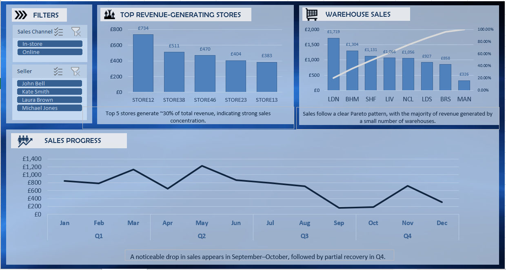
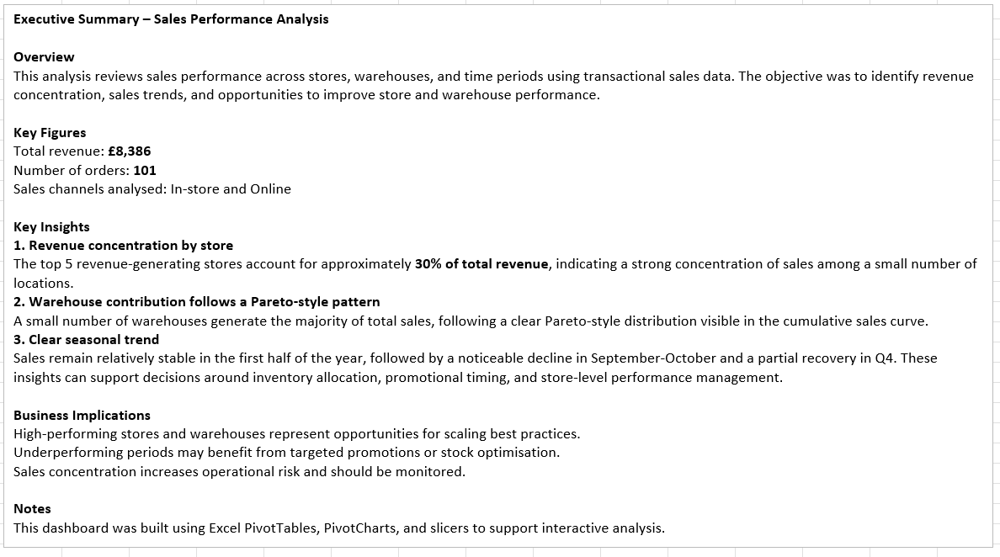
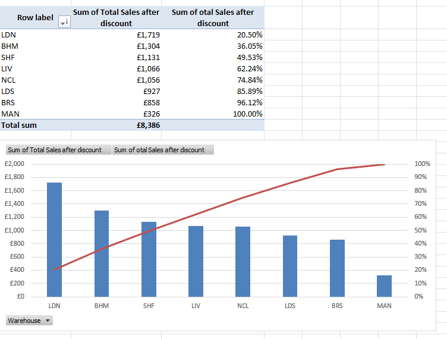

# Sales Performance – Excel Dashboard

An interactive Excel dashboard analysing sales performance across stores, warehouses, and time periods using transactional sales data.

This project focuses on identifying revenue concentration, sales trends, and potential optimisation opportunities, with an emphasis on clear business insights rather than purely technical output.

---

## Dashboard preview

---

## Executive summary

---

## Key figures

- Total revenue: **£8,386**
- Number of orders: **101**
- Sales channels analysed: **In-store and Online**

---

## Key insights

- **Revenue concentration by store**  
  The top 5 revenue-generating stores account for approximately **30% of total revenue**, indicating strong sales concentration across a small number of locations.

- **Warehouse sales follow a Pareto-style pattern**  
  A small number of warehouses generate the majority of total sales, following a clear cumulative distribution visible in the Pareto chart.

- **Seasonal sales trend**  
  Sales remain relatively stable in the first half of the year, followed by a noticeable decline in September-October and a partial recovery in Q4.

---

## Warehouse contribution (Pareto analysis)

---

## Dataset

This project uses a publicly available sales dataset sourced from **Kaggle**, adapted for analytical and dashboarding purposes.

The dataset includes:
- Order details
- Sales channels (In-store, Online)
- Store and warehouse information
- Discounts and revenue calculations

The data was cleaned, structured, and prepared for analysis in Excel.

---

## What I did

- Structured raw transactional data into a clean Excel table
- Created calculated fields for revenue before and after discount
- Built core KPIs to track overall performance
- Used PivotTables and PivotCharts to analyse:
  - Store-level performance
  - Warehouse contribution
  - Monthly and quarterly sales trends
- Designed an interactive dashboard using slicers for:
  - Sales channel
  - Seller
- Wrote an executive summary translating data into business insights

---

## Tools

- Microsoft Excel  
  (Tables, PivotTables, PivotCharts, slicers)

---

## Files

- [sales-performance-excel-dashboard.xlsx](sales-performance-excel-dashboard.xlsx) - full Excel dashboard file  
- [screenshots](screenshots/) - dashboard and analysis visuals

---

## Notes

This project was originally created as an early Excel dashboard and later refined to improve analytical clarity, business narrative, and presentation for portfolio use.

